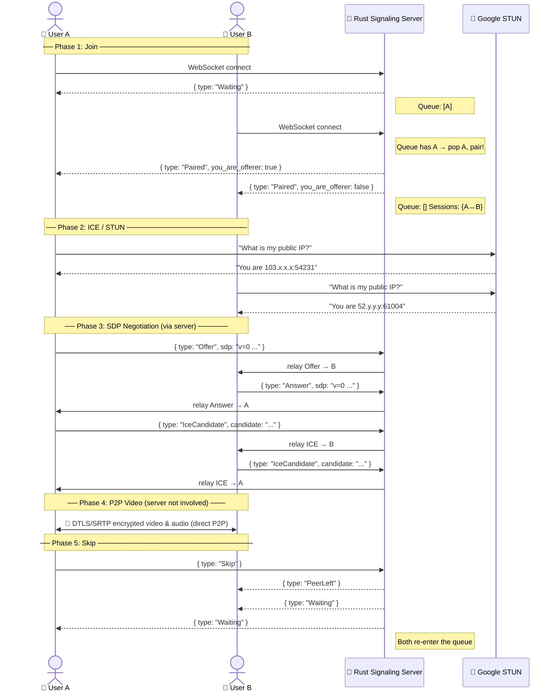
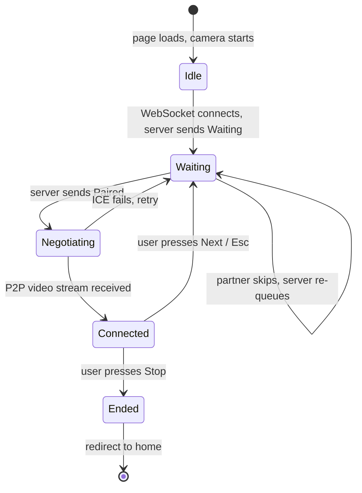

# MisMatch — Architecture

## Tech Stack

| Layer | Technology | Why |
|---|---|---|
| **Signaling Server** | Rust + Axum 0.7 | Fast, safe, async WebSocket handling |
| **Matchmaking State** | `DashMap` + `tokio::sync::Mutex` | Lock-free concurrent HashMap for sessions; Mutex for the ordered queue |
| **Transport** | WebSocket (axum `ws` feature) | Full-duplex, low-latency, browser-native |
| **P2P Video** | Browser `RTCPeerConnection` (WebRTC) | Direct encrypted video, no server relay |
| **NAT Traversal** | Google STUN `stun.l.google.com:19302` | Discovers each peer's public IP |
| **Frontend** | Next.js 16 (App Router) + Vanilla CSS | SSR-ready, simple, no framework overhead |
| **Hosting — Backend** | Render (Docker / musl static binary) | Free tier, always accessible |
| **Hosting — Frontend** | Vercel | Free, auto-deploy on git push |

---

## Full Flow — User A meets User B



---

## Matchmaking Queue — How It Works

```mermaid
flowchart TD
    Connect([User connects via WebSocket]) --> Assign[Assign anonymous UUID]
    Assign --> Check{Queue empty?}

    Check -- Yes --> AddQueue[Add self to VecDeque queue\nSend: Waiting]
    Check -- No  --> Pop[Pop first peer from queue]

    Pop --> Pair[Register session in DashMap:\nSessions[A] = B\nSessions[B] = A]
    Pair --> Notify[Send Paired to both\nA: you_are_offerer = true\nB: you_are_offerer = false]

    AddQueue --> Wait([Wait for next user to join])
    Wait --> Connect

    Notify --> SDP[SDP + ICE exchange via server]
    SDP --> P2P[P2P video established]
    P2P --> Skip{User presses\nNext or Esc?}

    Skip -- Yes --> Cleanup[Remove session from DashMap\nNotify partner: PeerLeft\nRe-queue both peers]
    Cleanup --> Connect

    Skip -- No --> P2P
```

---

## State Diagram (Per Connection)



---

## Server State — Rust Data Structures

```
AppState {
    waiting: Arc<Mutex<VecDeque<PeerHandle>>>
    ┌─────────────────────────────┐
    │  VecDeque (FIFO queue)      │
    │  [ PeerHandle{uuid, tx} ]   │  ← new users added to back
    │  pop_front() when pairing   │  ← oldest waiter matched first
    └─────────────────────────────┘

    sessions: Arc<DashMap<Uuid, Session>>
    ┌──────────────────────────────────────────┐
    │  Key: Uuid (my ID)                       │
    │  Value: Session { partner: PeerHandle }  │
    │                                          │
    │  Stored in both directions:              │
    │  sessions[A.id] = Session { partner: B } │
    │  sessions[B.id] = Session { partner: A } │
    └──────────────────────────────────────────┘
}
```

**PeerHandle** = `{ id: Uuid, tx: mpsc::Sender<SignalMessage> }`
The `tx` is a Tokio channel — sending a message to it asynchronously pushes it to that peer's WebSocket outbox without any locks.

---

## Message Protocol (WebSocket JSON)

```
Client → Server                Server → Client
─────────────────              ──────────────────────────────────
{ type: "Skip" }       →       { type: "Waiting" }
{ type: "Ready" }      →       { type: "Paired",
                                  you_are_offerer: bool }
{ type: "Offer",       →       { type: "Offer", sdp }
    sdp: "..." }               { type: "Answer", sdp }
{ type: "Answer",      →       { type: "IceCandidate",
    sdp: "..." }                 candidate, sdp_mid,
{ type:                →         sdp_m_line_index }
  "IceCandidate",              { type: "PeerLeft" }
  candidate, ... }
```

---

## Deployment Architecture

```
┌──────────────────────────────────────────────────────────────┐
│  User A Browser               User B Browser                 │
│  (Chrome / Firefox)           (Chrome / Firefox)             │
│                                                              │
│  Next.js SPA                  Next.js SPA                    │
│  ├─ lib/signaling.ts          ├─ lib/signaling.ts            │
│  └─ lib/webrtc.ts             └─ lib/webrtc.ts               │
└──────┬────────────────────────────────┬──────────────────────┘
       │  WSS (signaling only)          │  WSS (signaling only)
       ▼                                ▼
┌──────────────────────────────────────────────────────────────┐
│       Rust Signaling Server — Render (Docker / musl)         │
│       https://mismatch-cx4b.onrender.com                     │
│                                                              │
│  axum Router                                                 │
│  ├── GET /ws      → ws_handler() → matchmaking + relay       │
│  └── GET /health  → "OK"                                     │
│                                                              │
│  AppState                                                    │
│  ├── WaitingQueue: VecDeque<PeerHandle>  (Mutex)            │
│  └── Sessions:     DashMap<Uuid, Session>                    │
└──────────────────────────────────────────────────────────────┘
       │  DTLS/SRTP (after signaling, server not involved)
       ▼
┌──────────────────────────────────────────────────────────────┐
│                    Google STUN Server                        │
│             stun.l.google.com:19302  (free, public)          │
│   Tells each browser its own public IP — used for ICE        │
└──────────────────────────────────────────────────────────────┘
       │  P2P (bypasses all servers, direct browser-to-browser)
       ▼
┌──────────────────────────────────────────────────────────────┐
│   Video / Audio Stream — encrypted DTLS/SRTP                 │
│   Flows directly browser ↔ browser                           │
│   ~20ms latency, no bandwidth cost on server                 │
└──────────────────────────────────────────────────────────────┘

Frontend hosting:  Vercel (CDN, auto-deploy on push)
Backend hosting:   Render free tier (Docker, musl static binary)
```
