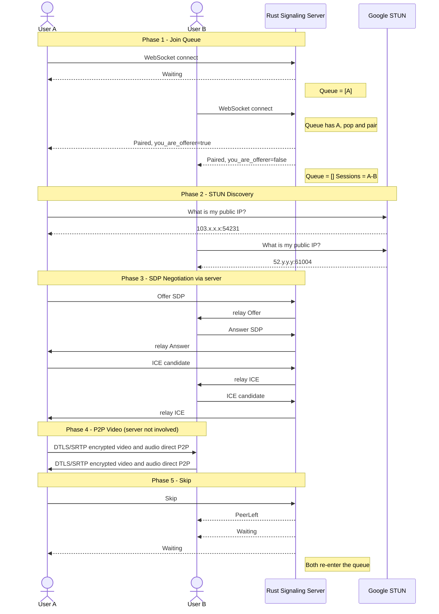
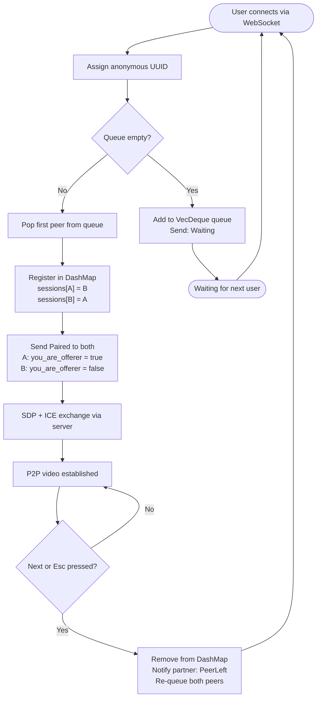
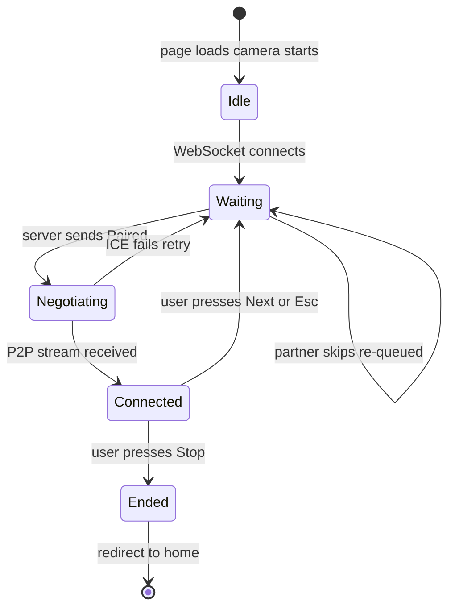

# MisMatch — Architecture

## Tech Stack

| Layer | Technology | Why |
|---|---|---|
| **Signaling Server** | Rust + Axum 0.7 | Fast, safe, async WebSocket handling |
| **Matchmaking State** | `DashMap` + `tokio::sync::Mutex` | Lock-free concurrent HashMap for sessions; Mutex for the ordered queue |
| **Transport** | WebSocket (axum `ws` feature) | Full-duplex, low-latency, browser-native |
| **P2P Video** | Browser `RTCPeerConnection` (WebRTC) | Direct encrypted video, no server relay |
| **NAT Traversal** | Google STUN `stun.l.google.com:19302` | Discovers each peer's public IP |
| **Frontend** | Next.js 16 (App Router) + Vanilla CSS | SSR-ready, simple, no framework overhead |
| **Hosting - Backend** | Render (Docker / musl static binary) | Free tier, always accessible |
| **Hosting - Frontend** | Vercel | Free, auto-deploy on git push |

---

## Full Flow — User A meets User B



---

## Matchmaking Queue — How It Works



---

## State Diagram (Per Connection)



---

## Server State — Rust Data Structures

```
AppState {
    waiting: Arc<Mutex<VecDeque<PeerHandle>>>
    ┌─────────────────────────────┐
    │  VecDeque (FIFO queue)      │
    │  [ PeerHandle{uuid, tx} ]   │  <- new users added to back
    │  pop_front() when pairing   │  <- oldest waiter matched first
    └─────────────────────────────┘

    sessions: Arc<DashMap<Uuid, Session>>
    ┌──────────────────────────────────────────┐
    │  Key: Uuid (my ID)                       │
    │  Value: Session { partner: PeerHandle }  │
    │                                          │
    │  Stored in both directions:              │
    │  sessions[A.id] = Session { partner: B } │
    │  sessions[B.id] = Session { partner: A } │
    └──────────────────────────────────────────┘
}
```

**PeerHandle** = `{ id: Uuid, tx: mpsc::Sender<SignalMessage> }`

The `tx` is a Tokio channel — sending a message to it pushes it to that peer's WebSocket outbox without any locks.

---

## Message Protocol (WebSocket JSON)

| Direction | Message |
|---|---|
| Client to Server | `{ type: "Skip" }` |
| Client to Server | `{ type: "Ready" }` |
| Client to Server | `{ type: "Offer", sdp: "..." }` |
| Client to Server | `{ type: "Answer", sdp: "..." }` |
| Client to Server | `{ type: "IceCandidate", candidate, sdp_mid, sdp_m_line_index }` |
| Server to Client | `{ type: "Waiting" }` |
| Server to Client | `{ type: "Paired", you_are_offerer: bool }` |
| Server to Client | `{ type: "Offer", sdp }` (relayed) |
| Server to Client | `{ type: "Answer", sdp }` (relayed) |
| Server to Client | `{ type: "IceCandidate", ... }` (relayed) |
| Server to Client | `{ type: "PeerLeft" }` |

---

## Deployment Architecture

```
┌──────────────────────────────────────────────────────────────┐
│  User A Browser               User B Browser                 │
│  (Chrome / Firefox)           (Chrome / Firefox)             │
│                                                              │
│  Next.js SPA (Vercel)         Next.js SPA (Vercel)           │
│  lib/signaling.ts             lib/signaling.ts               │
│  lib/webrtc.ts                lib/webrtc.ts                  │
└──────┬────────────────────────────────┬──────────────────────┘
       │  WSS (signaling only)          │  WSS (signaling only)
       v                                v
┌──────────────────────────────────────────────────────────────┐
│       Rust Signaling Server  (Render - Docker/musl)          │
│       https://mismatch-cx4b.onrender.com                     │
│                                                              │
│  axum Router                                                 │
│  GET /ws      -> ws_handler() -> matchmaking + relay         │
│  GET /health  -> "OK"                                        │
│                                                              │
│  AppState                                                    │
│  WaitingQueue: VecDeque<PeerHandle>  (Mutex)                 │
│  Sessions:     DashMap<Uuid, Session>                        │
└──────────────────────────────────────────────────────────────┘
       │  ICE discovery (one-time, at connection setup)
       v
┌──────────────────────────────────────────────────────────────┐
│  Google STUN  stun.l.google.com:19302  (free, public)        │
│  Tells each browser its own public IP for ICE negotiation    │
└──────────────────────────────────────────────────────────────┘
       │  P2P - bypasses all servers after ICE completes
       v
┌──────────────────────────────────────────────────────────────┐
│  Video / Audio: encrypted DTLS/SRTP browser to browser       │
│  ~20ms latency, zero server bandwidth cost                   │
└──────────────────────────────────────────────────────────────┘

Frontend: Vercel (CDN, auto-deploy on push)
Backend:  Render free tier (Docker, musl static binary ~6MB)
```
